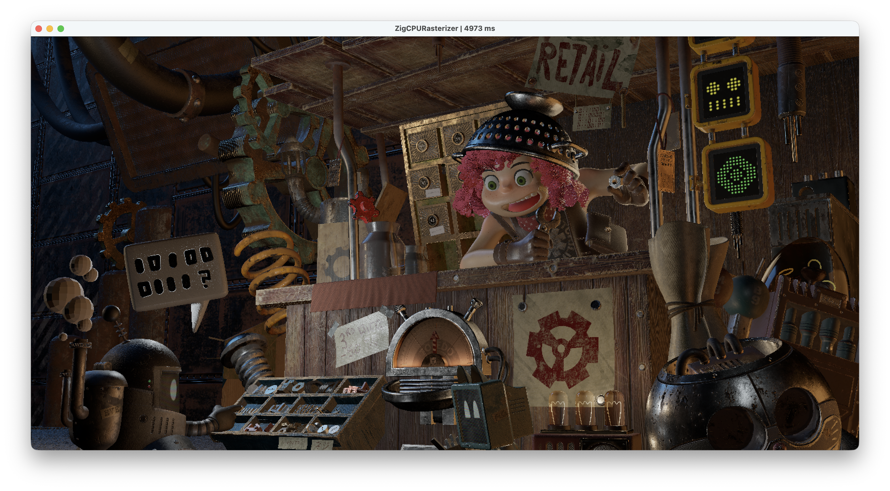
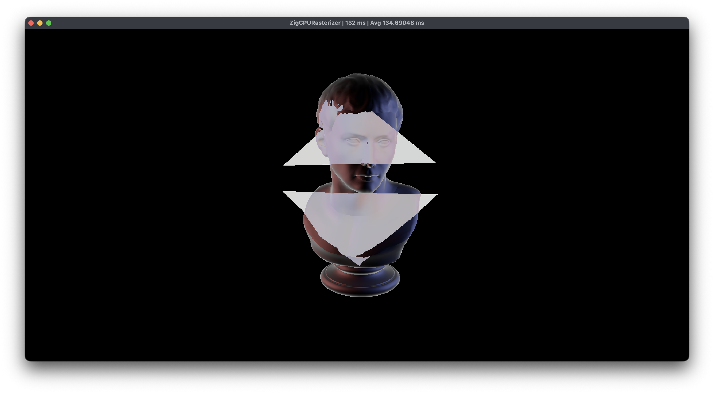

A CPU Rasterizer written in Zig during my free time for fun and to learn.

- Forward Renderer
- PBR Shading (Albedo, Metallic, Roughness, Transmission, Emissive)
- Lights: Area, Point, Directional
- Texture (Bilinear sampling)
- Transmission shading (with crude screen-space refraction)
- glTF format (W.I.P, doesn't support .glb file, spotlight, among some other things)

Zig version: 0.15.2

## Build Instructions

Put glTF (.gltf) in project_root/assets/ with below structure:

```
project_root/
		assets/
				some_demo/
						demo.gltf
						demo.bin
								textures/
										...
```

Replace similar line with your own gltf files in `src/renderer/rasterizer.zig - init()`:

```
scene = try Scene.fromGLTFFile("assets/some_demo/demo.gltf", allocator);
```

Run (in project_root):

```
zig build run -Doptimize=ReleaseFast
```
---

Screenshot:

The Junk Shop:



Lumberyard Bistro:


[Marble Bust](https://polyhaven.com/a/marble_bust_01):



---

Some refs:

- https://www.scratchapixel.com/ (Huge thanks)
- http://acta.uni-obuda.hu/Mileff_Nehez_Dudra_63.pdf
- https://fgiesen.wordpress.com/2013/02/10/optimizing-the-basic-rasterizer/
- https://www.cs.drexel.edu/~david/Classes/Papers/comp175-06-pineda.pdf

Lion (Prev | ReleaseFast):
Frame Time (Min - Max): 22 - 31
Avg.  Time (Min - Max): 26.68868 - 30.67742


Lion (New | ReleaseFast):
Frame Time (Min - Max): 19 - 27
Avg.  Time (Min - Max): 21.70513 - 23.67742


Lion (Prev | Debug):
Frame Time (Min - Max): 106 - 142
Avg.  Time (Min - Max): 122.10526 - 128.07500


Lion (New | Debug):
Frame Time (Min - Max): 92 - 118
Avg.  Time (Min - Max): 107.01357 - 112.09677


Note: There wasn't any (apparent) performance improvement from using 
new datastructure compared to used zigimg directly. Most of the improvements
is from moving image operation (normal map [0, 1] -> [-1, 1] and albedo's srgb -> linear)
conversions.
