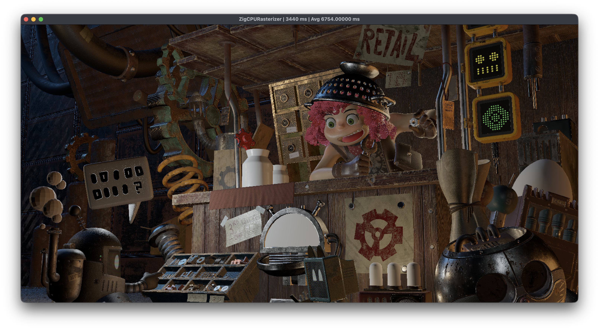

A CPU Rasterizer written in Zig during my free time for fun and to learn.

Checkout `Computer Graphics from Scratch` section on: https://blackgoku36.github.io/BG36Notes/

If I remember correctly, I got spot model from: https://www.cs.cmu.edu/~kmcrane/Projects/ModelRepository/

## BUILD INSRTUCTIONS

Requirements:
- The submodules
- Sokol-shdc bin from [here](https://github.com/floooh/sokol-tools-bin), and set ENV var to it. (to compile sokol side shader, in case you just want to run, you can comment out `line 15` from `build.zig` as the shader is already compiled).

Just do:

```
zig build run -Drelease-fast
```

You should get:


Some refs:

- https://www.scratchapixel.com/ (Huge thanks)
- http://acta.uni-obuda.hu/Mileff_Nehez_Dudra_63.pdf
- https://fgiesen.wordpress.com/2013/02/10/optimizing-the-basic-rasterizer/
- https://www.cs.drexel.edu/~david/Classes/Papers/comp175-06-pineda.pdf